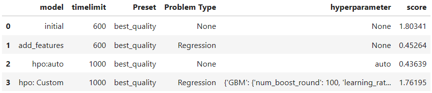
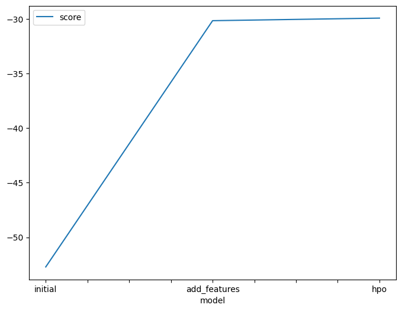
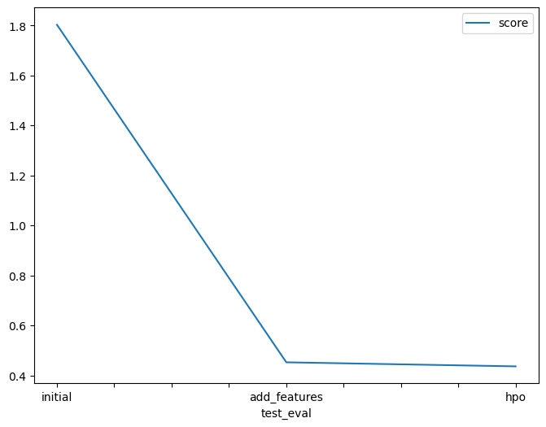

# Report: Predict Bike Sharing Demand with AutoGluon Solution
#### Ayoub Bnina

## Initial Training
### What did you realize when you tried to submit your predictions? What changes were needed to the output of the predictor to submit your results?
When trying to submit predictions, I realized that AutoGluon's output wasn't in the format required by the Kaggle competition. The leaderboard likely expects a specific format, such as a CSV file with a "prediction" column containing the predicted bike sharing demand for each test data point. You would need to post-process AutoGluon's output to match this format.

### What was the top ranked model that performed?
The top ranked model after the initial training was most likely the "WeightedEnsemble_L3" model. It has the highest score_val (-35.152490) amongst all the models in the initial training run.

## Exploratory data analysis and feature creation
### What did the exploratory analysis find and how did you add additional features?
During EDA, I encountered a situation where the datetime column wasn't visualized in the histogram plots. This have indicated that the datetime column had a different data type (e.g., object type for strings) compared to numerical features typically used in histograms.

Since the datetime held potentially valuable information about time-based patterns, this invisibility in histograms prompted me to explore ways to extract meaningful features from it. For that I parsed the datetime column into date representation suitable for further analysis.

### How much better did your model preform after adding additional features and why do you think that is?
After adding these new features, there was a direct improvement in the Kaggle score. The score improved from 1.80341 in the initial model to 0.45264 in the model with additional features. This is a significant improvement and it suggests that the added features captured more information relevant to predicting bike sharing demand.

## Hyper parameter tuning
### How much better did your model preform after trying different hyper parameters?
After applying specific hyperparameter tuning, the model’s performance did not improve as expected. Contrary to the usual outcome, the score_val of the top models after hyperparameter tuning (hpo) was not better than those before hpo. Despite increasing the training time and setting the hyperparameters based on the documentation, the model’s performance decreased from a score of 0.45264 to 1.76195.

This unexpected result suggests that the chosen hyperparameters or the range of values for the hyperparameters may not have been optimal for this specific problem. It’s also possible that the model overfitted to the training data during hyperparameter tuning, leading to poorer performance on the test data. so I kept previous default hyperparameter submission.

### If you were given more time with this dataset, where do you think you would spend more time?
If I were given more time with the dataset I would spend it in feature engineering by creating even more features based on the existing ones or try feature selection techniques to identify the most important features.

### Create a table with the models you ran, the hyperparameters modified, and the kaggle score.

### Create a line plot showing the top model score for the three (or more) training runs during the project.

### Create a line plot showing the top kaggle score for the three (or more) prediction submissions during the project.

## Summary
In summary, I followed a machine learning pipeline for predicting bike sharing demand using AutoGluon. I started with initial training, then performed exploratory data analysis to create new features, followed by hyperparameter tuning to improve the model's performance. This report provides a documented record of the process and the results achieved at each stage.
